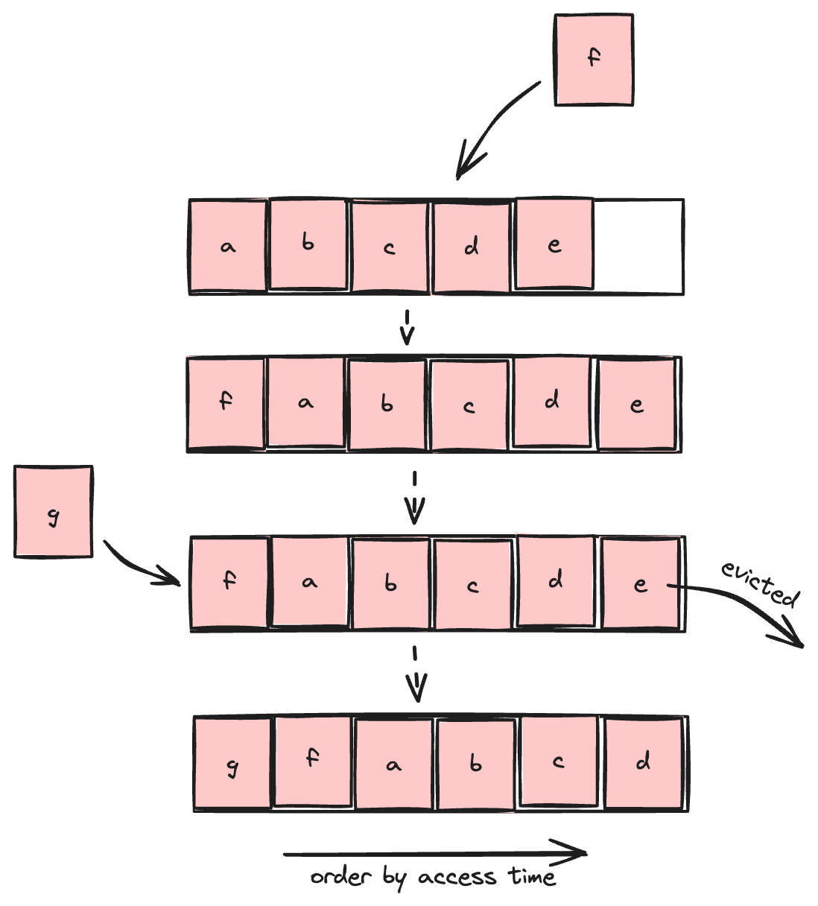

> I started blogging with this cache algorithm because I made mistakes implementing it during my TikTok interview 😕.

## Introduction

**What is caching?** Caching is the process of storing copies of data in temporary storage so that it can be retrieved more quickly. By having frequently accessed data readily available, caching plays a crucial role in enhancing performance and efficiency in computing systems.

<!-- truncate -->

Caches are integral components of many systems, found in various places such as:

- CPU Caches: L1, L2, and L3 caches within the CPU to speed up data access.
- DNS Caches: Present in both browsers and operating systems to store DNS query results.
- Browser Caches: Used to store static files for faster retrieval.
- Dedicated Cache Servers: Such as Redis, employed to handle high-performance caching needs.

The purpose of caching is mainly to boost data retrieval performance, which means it may not guarantee data availability or consistency. When data is not found in the cache, the default behavior is usually to query it from the primary data storage.

## What is LRU Cache?

The Least Recently Used (LRU) Cache is a cache that will evict least recently used data when the cache is full. In other words, that type of cache keeps most recently accessed data remain available. The below figure briefly shows how LRU Cache works.

Simply put, an LRU (Least Recently Used) Cache is a data structure that follows the LRU rule. It stores data and allows two actions on that data:

- **get**: Retrieves data from the cache.
- **put**: Inserts data into the cache.

## Implement a LRU Cache

(to be continued...)
