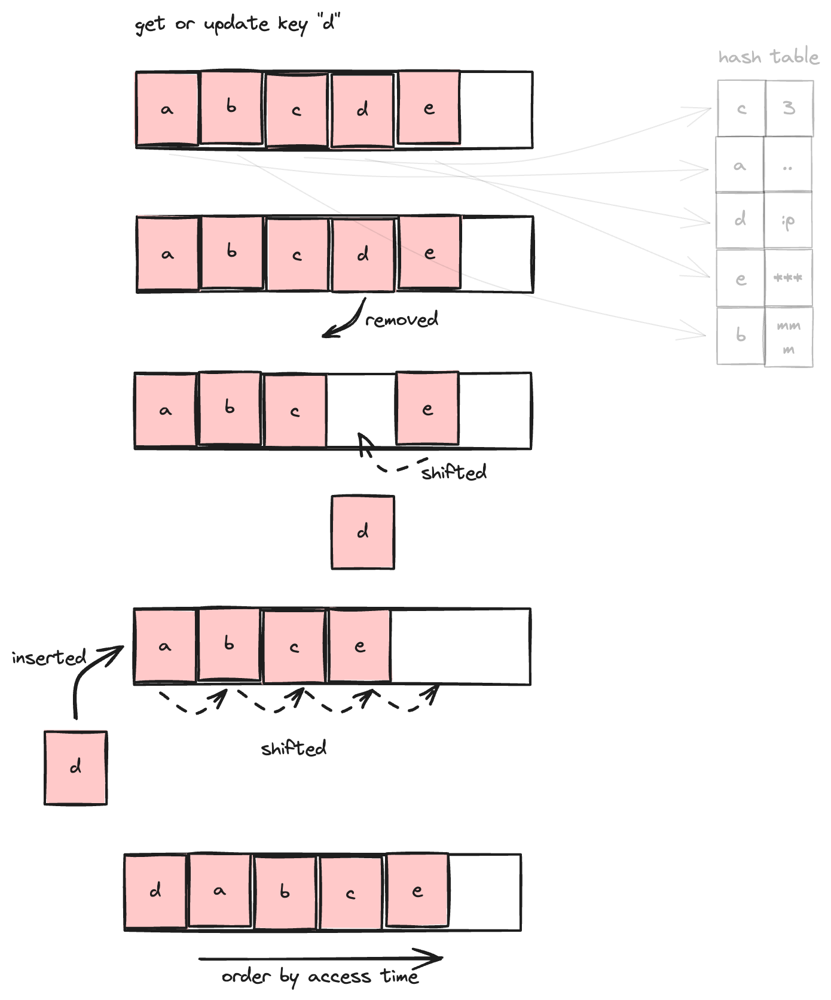
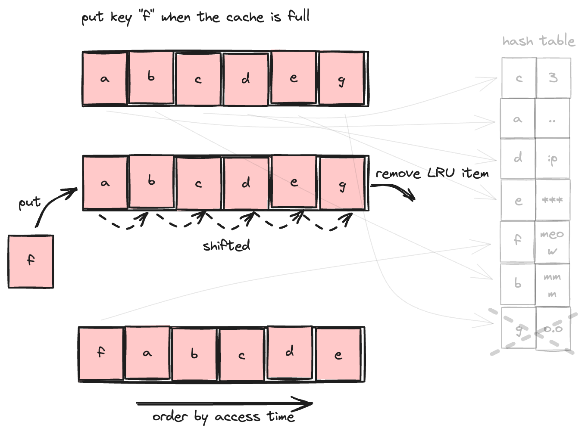

> I started blogging with this cache algorithm because I made mistakes implementing it during my TikTok interview 😕.


## Introduction

**What is caching?** Caching is the process of storing copies of data in temporary storage so that it can be retrieved more quickly. By having frequently accessed data readily available, caching plays a crucial role in enhancing performance and efficiency in computing systems.

<!-- truncate -->

Caches are integral components of many systems, found in various places such as:

- CPU Caches: L1, L2, and L3 caches within the CPU to speed up data access.
- DNS Caches: Present in both browsers and operating systems to store DNS query results.
- Browser Caches: Used to store static files for faster retrieval.
- Dedicated Cache Servers: Such as Redis, employed to handle high-performance caching needs.

The purpose of caching is mainly to boost data retrieval performance, which means it may not guarantee data availability or consistency. When data is not found in the cache, the default behavior is usually to query it from the primary data storage.

## What is LRU Cache?

The Least Recently Used (LRU) Cache is a cache that will evict least recently used data when the cache is full. In other words, that type of cache keeps most recently accessed data remain available. The below figure briefly shows how LRU Cache works.


Simply put, an LRU (Least Recently Used) Cache is a data structure that follows the LRU rule. It stores data and allows two actions on that data:

- **get**: Retrieves data from the cache.
- **put**: Inserts data into the cache.

## Implement an LRU Cache

In an LRU cache, maintaining the order of data according to LRU rules is crucial. Specifically, the order of data must be updated every time data is retrieved or put into the cache. This ensures that the least recently used items are evicted first when the cache reaches its capacity.

### A naïve solution

With this approach, we maintain the order of data using an array of keys, while the actual data is stored in a key-value hashtable, which allows for constant time retrieval and update operations. The below figures clarify those operations.

Behavior when getting data or updating existing data:



Behavior when putting new data to a full cache:



Here is the implementation in Python:

```python title="naive-solution.py"
class LRUCache:

    def __init__(self, capacity):
        self.capacity = capacity  # the maximum number of items that the cache can store
        self.keys = list()  # stores keys and maintains their order
        self.data = dict()  # map between keys and values

    def get(self, key):
        if key in self.data:  # time complexity: O(1)
            # because the key is accessed, we need to update the key list's order
            self.keys.remove(key)  # remove the key from the list
            self.keys.insert(0,
                             key)  # insert to the key to the first of the list

            # both of the above operations also have a time complexity of O(n)
            # since a part of the list needs to be shifted to keep the list in sequence.

            return self.data[key]  # return data (O(1))

        return None  # return None if the data isn't in cache

    def put(self, key, value):
        # putting a value is treated as accessing data, so the order should also be updated
        if key in self.data:  # time complexity: O(1)
            self.keys.remove(key)
        elif len(
                self.keys
        ) >= self.capacity:  # remove the least recently used item when the cache is full
            poppedKey = self.keys.pop(
            )  # the time complexity is O(1), because nothing needs to be shifted
            self.data.pop(poppedKey)  # O(1)

        self.keys.insert(0, key)  # O(n)
        self.data[key] = value  # O(1)

    def __str__(self):
        result = ""

        for key in self.keys:
            result += f"{key}:{self.data.get(key)} "

        return result


def main():
    cache = LRUCache(2)

    cache.put(1, 1)  # cache is {1=1}
    cache.put(2, 2)  # cache is {1=1, 2=2}
    print(cache.get(1))  # return 1
    cache.put(3, 3)  # LRU key was 2, evicts key 2, cache is {1=1, 3=3}
    print(cache.get(2))  # returns None (not found)
    cache.put(4, 4)  # LRU key was 1, evicts key 1, cache is {4=4, 3=3}
    print(cache.get(1))  # return None (not found)
    print(cache.get(3))  # return 3
    print(cache.get(4))  # return 4


if __name__ == "__main__":
    main()
```

As you can see, both **get** and **put** operations can have O(n) complexity in the worst case due to the need to shift elements in the array to maintain LRU order. However, this approach can be suitable for an interview scenario with time constraints, given its simplicity 😄.

You might wonder why I didn't handle inserting and removing at the same time, which could reduce the number of items needing to be shifted. The primary reason is that, generally, the time complexity remains the same, and I can leverage the efficient built-in list operations supported by Python.

### A better way

(to be continued...)
