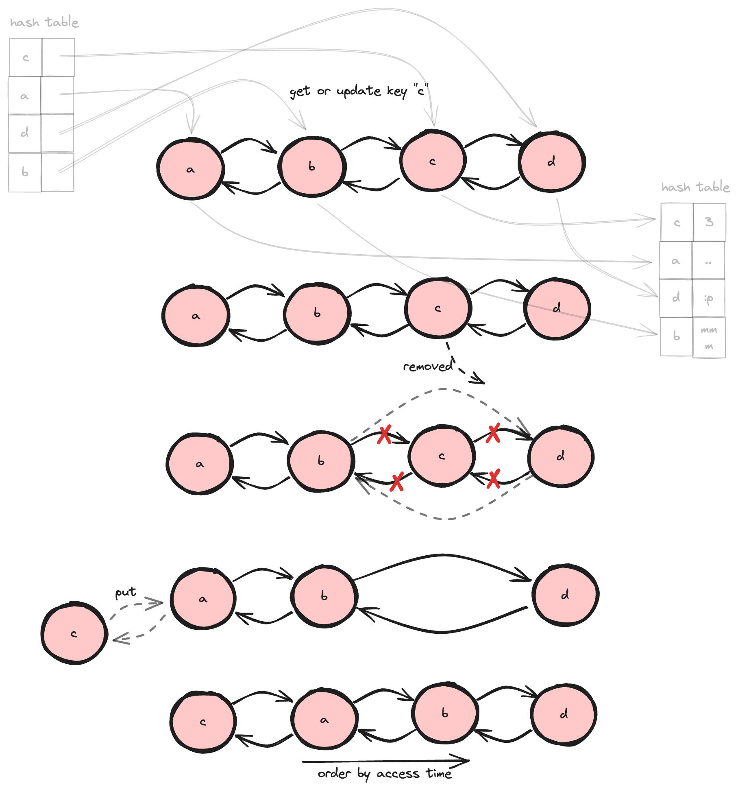

> I started blogging with this cache algorithm because I made mistakes implementing it during my TikTok interview 😕.


## Introduction

**What is caching?** Caching is the process of storing copies of data in temporary storage so that it can be retrieved more quickly. By having frequently accessed data readily available, caching plays a crucial role in enhancing performance and efficiency in computing systems.

<!-- truncate -->

Caches are integral components of many systems, found in various places such as:

- CPU Caches: L1, L2, and L3 caches within the CPU to speed up data access.
- DNS Caches: Present in both browsers and operating systems to store DNS query results.
- Browser Caches: Used to store static files for faster retrieval.
- Dedicated Cache Servers: Such as Redis, employed to handle high-performance caching needs.

The purpose of caching is mainly to boost data retrieval performance, which means it may not guarantee data availability or consistency. When data is not found in the cache, the default behavior is usually to query it from the primary data storage.

## What is LRU Cache?

The Least Recently Used (LRU) Cache is a cache that will evict least recently used data when the cache is full. In other words, that type of cache keeps most recently accessed data remain available. The below figure briefly shows how LRU Cache works.


Simply put, an LRU (Least Recently Used) Cache is a data structure that follows the LRU rule. It stores data and allows two actions on that data:

- **get**: Retrieves data from the cache.
- **put**: Inserts data into the cache.

## Implement an LRU Cache

In an LRU cache, maintaining the order of data according to LRU rules is crucial. Specifically, the order of data must be updated every time data is retrieved or put into the cache. This ensures that the least recently used items are evicted first when the cache reaches its capacity.

### A naïve solution

With this approach, we maintain the order of data using an array of keys, while the actual data is stored in a key-value hashtable, which allows for constant time retrieval and update operations. The below figures clarify those operations.

Behavior when getting data or updating existing data:


Behavior when putting new data to a full cache:


Here is the implementation in Python:

```python
class LRUCache:

    def __init__(self, capacity: int):
        self.capacity = capacity  # the maximum number of items that the cache can store
        self.queue = list()  # stores keys and maintains their order
        self.cache = dict()  # map between keys and values

    def get(self, key: int) -> int:
        if key in self.queue:  # time complexity: O(n)
            # because the key is accessed, we need to update the key list's order
            self.queue.remove(key)  # remove the key from the list
            self.queue.insert(
                0, key)  # insert to the key to the first of the list

            # both of the above operations also have a time complexity of O(n)
            # since a part of the list needs to be shifted to keep the list in sequence.

            return self.cache[key]  # return data (O(1))

        return None  # return None if the data isn't in cache

    def put(self, key: int, value: int):
        # putting a value is treated as accessing data, so the order should also be updated
        if key in self.queue:  # time complexity: O(n)
            self.queue.remove(key)  # O(n)
        elif len(
                self.queue
        ) >= self.capacity:  # remove the least recently used item when the cache is full
            poppedKey = self.queue.pop(
            )  # the time complexity is O(1), because nothing needs to be shifted
            self.cache.pop(poppedKey)  # O(1)

        self.queue.insert(0, key)  # O(n)
        self.cache[key] = value  # O(1)


def main():
    cache = LRUCache(2)

    cache.put(1, 1)  # cache is {1=1}
    cache.put(2, 2)  # cache is {1=1, 2=2}
    print(cache.get(1))  # return 1
    cache.put(3, 3)  # LRU key was 2, evicts key 2, cache is {1=1, 3=3}
    print(cache.get(2))  # returns None (not found)
    cache.put(4, 4)  # LRU key was 1, evicts key 1, cache is {4=4, 3=3}
    print(cache.get(1))  # return None (not found)
    print(cache.get(3))  # return 3
    print(cache.get(4))  # return 4


if __name__ == "__main__":
    main()
```

As you can see, both **get** and **put** operations can have O(n) complexity in the worst case due to the need to shift elements in the array to maintain LRU order. However, this approach can be suitable for an interview scenario with time constraints, given its simplicity 😄.

You might wonder why I didn't handle inserting and removing at the same time, which could reduce the number of items needing to be shifted. The primary reason is that, generally, the time complexity remains the same, and I can leverage the efficient built-in list operations supported by Python.

### A better way

In this way, we try to eliminate O(n) operations when working with arrays. Instead, we use a doubly linked list, which avoids the need to shift elements each time we insert or delete. To access elements in constant time, we create an additional hash table that maps keys to references of the doubly linked list's nodes. This transforms all previous O(n) operations into O(1) operations. The figures below will illustrate how this works.

Behavior when getting data or updating existing data:



Behavior when putting new data to a full cache:


Here is the implementation in Python:

```python
class Node:

    def __init__(self, key, value):
        self.key = key
        self.value = value
        self.prev = None
        self.next = None


class LRUCache:

    def __init__(self, capacity: int):
        self.capacity = capacity
        self.cache = dict()  # hash table to store key-node pairs
        self.head = Node(None, None)  # dummy head
        self.tail = Node(None, None)  # tummy tail
        self.head.next = self.tail
        self.tail.prev = self.head

    def _remove(self, node: Node):  # O(1)
        prevNode = node.prev
        nextNode = node.next
        prevNode.next = nextNode
        nextNode.prev = prevNode

    def _add(self, node: Node):  # O(1)
        node.prev = self.head
        node.next = self.head.next
        self.head.next.prev = node
        self.head.next = node

    def get(self, key: int) -> int:
        if key in self.cache:
            node = self.cache[key]
            self._remove(node)  # remove node
            self._add(node)  # re-add
            return node.value

        return None

    def put(self, key: int, value: int):
        if key in self.cache:
            self._remove(self.cache[key])  # remove node
        elif len(self.cache) >= self.capacity:  # handle LRU item
            lru = self.tail.prev
            self._remove(lru)
            self.cache.pop(lru.key)

        node = Node(key, value)
        self._add(node)
        self.cache[key] = node


def main():
    cache = LRUCache(2)

    cache.put(1, 1)  # cache is {1=1}
    cache.put(2, 2)  # cache is {1=1, 2=2}
    print(cache.get(1))  # return 1
    cache.put(3, 3)  # LRU key was 2, evicts key 2, cache is {1=1, 3=3}
    print(cache.get(2))  # returns None (not found)
    cache.put(4, 4)  # LRU key was 1, evicts key 1, cache is {4=4, 3=3}
    print(cache.get(1))  # return None (not found)
    print(cache.get(3))  # return 3
    print(cache.get(4))  # return 4


if __name__ == "__main__":
    main()
```

Note: For convenience, I've stored the data directly to the double linked list instead of creating a seperate data hash table.

### Real-world implementations

In real-world systems, you often encounter cache-like algorithms in operating systems and services like Redis. However, these implementations don't always use a true LRU algorithm due to practical considerations.

Operating systems often use approximations of the LRU algorithm. Implementing a precise LRU cache at the scale required by modern operating systems can be resource-intensive, both in terms of memory and processing power. Instead, OS designers use algorithms like Clock (or Second Chance) that provide a good approximation of LRU behavior with lower overhead. These approximations maintain the efficiency of memory management without the complexity of true LRU implementation.

Similarly, Redis employs an approximation of LRU in its eviction policy. True LRU requires updating the order of elements with every access, which can be costly in a high-throughput system like Redis. Instead, Redis uses a sampling approach: it randomly samples a subset of keys and evicts the least recently used key among them. This method significantly reduces the computational overhead while still providing reasonably effective cache eviction behavior.

By not implementing a strict LRU algorithm, these systems achieve a balance between performance and resource utilization, ensuring they can handle large volumes of data efficiently without the overhead of maintaining perfect LRU order.

## Other types of cache

Apart from LRU, there are other common cache eviction policies like FIFO and LFU.

**FIFO (First-In-First-Out)**

- How it works: Evicts the oldest data (the first one that was added) when the cache is full.
- Comparison with LRU: Simpler to implement but less efficient in terms of cache hits, as it doesn't consider how often or recently data is accessed.

**LFU (Least Frequently Used)**

- How it works: Evicts the data that is accessed least frequently.
- Comparison with LRU: Can be more effective than LRU for workloads with varying access patterns, but maintaining frequency counts can introduce additional overhead.

Both FIFO and LFU offer different trade-offs compared to LRU. FIFO is straightforward but less adaptive, while LFU can handle diverse access patterns but may be more complex to manage. LRU strikes a balance by focusing on recent access patterns, making it a popular choice for many caching scenarios.

## Conclusion

This blog covers the Least Recently Used (LRU) cache, a key data structure for efficient data retrieval. We explained how LRU caches use a doubly linked list and hash map for O(1) operations, compared it with FIFO and LFU strategies, and discussed its approximations in real-world systems like operating systems and Redis. We also provided a concise Python implementation, highlighting its practical use and performance benefits.

## References

- Redis Glossary about [LRU Cache](https://redis.io/glossary/lru-cache/)
- Redis Document about [Key Eviction Policy](https://redis.io/docs/latest/develop/reference/eviction/)
- “Understanding how the system manages memory” in [UNIX and Linux System Administration Handbook, 5E](https://www.oreilly.com/library/view/unix-and-linux/9780134278308/) by Evi Nemeth, Garth Snyder, Trent R. Hein, Ben Whaley and Dan Mackin
